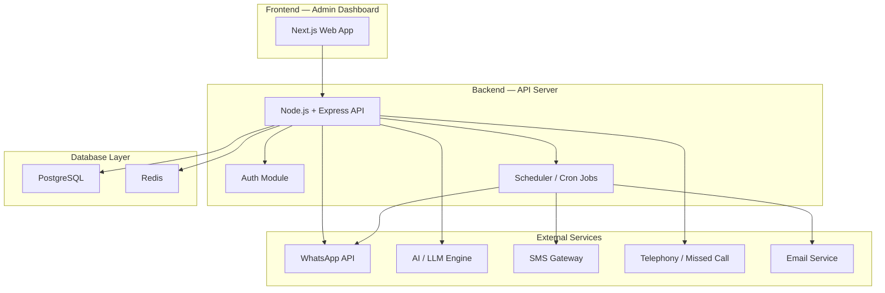
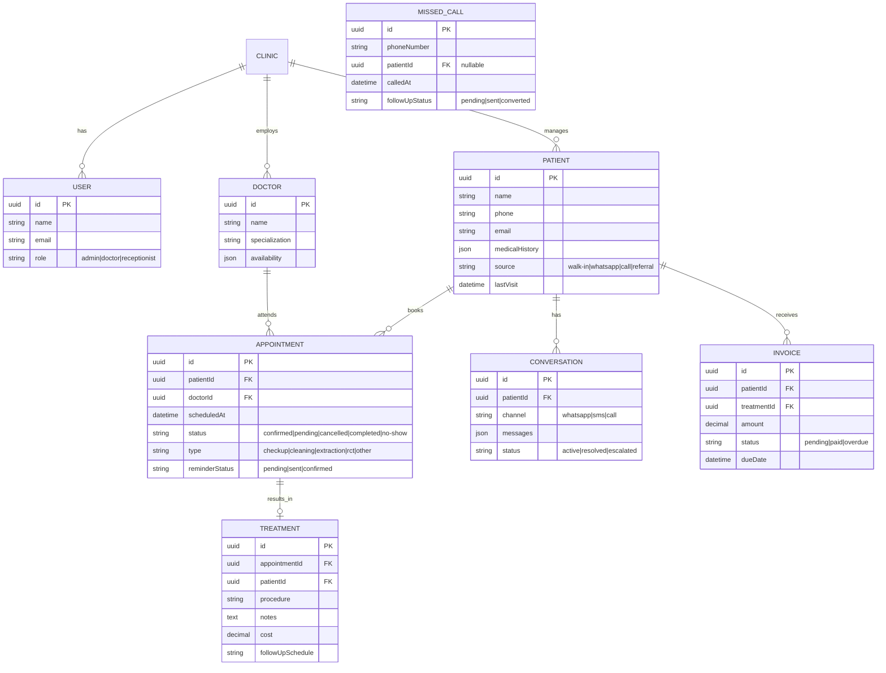

# Dental Clinic Management — Full Application Plan

A production-ready web application for a dental clinic that automates WhatsApp communications, provides an AI chatbot for patient queries, manages appointments with reminders, handles missed-call follow-ups, automates patient follow-ups, and offers a full CRM/patient management workflow.

---

## 1. High-Level Architecture



---

## 2. Feature Breakdown

### 2.1 WhatsApp Appointment Automation
| Capability | Description |
|---|---|
| Booking via WhatsApp | Patients send a message → chatbot guides them to pick a slot → appointment created |
| Confirmation messages | Auto-send booking confirmation with date, time, doctor name |
| Rescheduling / Cancellation | Patient replies to reschedule or cancel; system updates CRM |
| Two-way sync | WhatsApp conversation state synced with CRM timeline |

### 2.2 AI Chatbot for Patient Questions
| Capability | Description |
|---|---|
| FAQ answering | Clinic hours, services, pricing, insurance, directions |
| Symptom triage (non-medical) | "I have a toothache" → suggests booking an emergency slot |
| Multi-language | English + Tamil (expandable) |
| Escalation | If AI can't answer, hand off to human receptionist via dashboard |
| Knowledge base | Admin-editable FAQ / knowledge base the AI uses as context |

### 2.3 Automatic Appointment Reminders
| Capability | Description |
|---|---|
| 24-hour reminder | WhatsApp + SMS reminder one day before |
| 2-hour reminder | WhatsApp message 2 hours before |
| Confirmation loop | Patient replies "Yes" / "No" → status updated |
| No-show detection | If patient doesn't confirm, flag for follow-up |

### 2.4 Missed-Call Follow-Up System
| Capability | Description |
|---|---|
| Missed call detection | Telephony webhook fires on missed call |
| Auto-callback SMS/WhatsApp | "We noticed you called! Book an appointment here: [link]" |
| Lead capture | Unknown numbers → auto-create lead in CRM |
| Dashboard alerts | Receptionist sees missed-call queue with one-click actions |

### 2.5 Patient Follow-Up Automation
| Capability | Description |
|---|---|
| Post-treatment follow-up | Auto-message 24h, 3 days, 7 days after treatment |
| Treatment-specific templates | Different follow-up for extraction vs. cleaning vs. root canal |
| Feedback collection | "Rate your experience 1–5" via WhatsApp |
| Re-engagement | Patients inactive > 6 months → "It's time for a checkup!" |

### 2.6 CRM & Patient Management
| Capability | Description |
|---|---|
| Patient profiles | Demographics, medical history, allergies, insurance |
| Appointment calendar | Drag-and-drop calendar with doctor/chair assignment |
| Treatment records | Past treatments, X-rays, notes |
| Billing & invoicing | Generate invoices, track payments |
| Analytics dashboard | Appointment stats, revenue, no-show rate, patient acquisition |
| Role-based access | Admin, Doctor, Receptionist roles |

---

## 3. Tech Stack — Free vs Paid Comparison

### 3.1 Frontend

| Component | Free Option | Paid Option |
|---|---|---|
| **Framework** | **Next.js 14** (free, open source) | Same |
| **UI Library** | **Shadcn/ui + Radix** (free) | Ant Design Pro ($999 license) |
| **Charts** | **Recharts** (free) | — |
| **Calendar** | **FullCalendar** (free tier) | FullCalendar Premium ($590/yr) |
| **State Mgmt** | **Zustand** (free) | — |

> [!TIP]
> The free frontend stack is production-grade. No need to pay here.

---

### 3.2 Backend & Database

| Component | Free Option | Paid Option |
|---|---|---|
| **Runtime** | **Node.js + Express** (free) | Same |
| **ORM** | **Prisma** (free) | Same |
| **Database** | **Supabase PostgreSQL** (free tier: 500 MB, 2 projects) | **Supabase Pro** ($25/mo) or **AWS RDS** ($15–50/mo) |
| **Cache** | **Upstash Redis** (free tier: 10K cmds/day) | **Upstash Pro** ($10/mo) or **Redis Cloud** |
| **Auth** | **Supabase Auth** or **NextAuth.js** (free) | **Auth0** ($23/mo for 1K users) |
| **Job Scheduler** | **BullMQ + Redis** (free, self-managed) | **Inngest** ($25/mo) |
| **Hosting** | **Vercel** (free hobby) / **Railway** (free trial) | **Vercel Pro** ($20/mo) / **AWS** |

> [!IMPORTANT]
> For a production clinic app, **Supabase Pro ($25/mo)** is strongly recommended for reliable database with backups and no row limits.

---

### 3.3 WhatsApp Integration

| Option | Type | Cost | Notes |
|---|---|---|---|
| **WhatsApp Business API (via Meta Cloud API)** | Official | **Free** for first 1,000 conversations/month; then $0.005–$0.08 per conversation | Best long-term option; requires Meta Business verification |
| **Twilio for WhatsApp** | Official partner | $0.005/msg + $0.005 WhatsApp fee | Easier setup, good docs, higher cost |
| **Wati.io** | SaaS | $49/mo (5 users) | No-code dashboard, quick setup |
| **Baileys (unofficial)** | Open source | **Free** | ⚠️ Unofficial, can get banned. NOT recommended for production |

> [!WARNING]
> **Do NOT use unofficial WhatsApp libraries (Baileys, Venom, etc.) for a production clinic app.** Meta actively bans these. Use the official Business API.

**Recommendation:** Start with **Meta Cloud API (free tier)** → scale to Twilio or Wati if you need advanced features.

---

### 3.4 AI / LLM Chatbot

| Option | Type | Cost | Notes |
|---|---|---|---|
| **Google Gemini API** | Cloud LLM | **Free tier:** 15 RPM, 1M tokens/day; **Paid:** $0.075/1M tokens (Flash) | Best free tier, great for FAQ bots |
| **OpenAI GPT-4o-mini** | Cloud LLM | $0.15/1M input tokens | High quality, cheap |
| **Ollama + Llama 3** | Self-hosted | **Free** (needs GPU server) | Full control, privacy, needs hardware |
| **Dialogflow CX** | Google | Free tier (basic), $0.007/request | Good for structured flows |

> [!TIP]
> **Gemini Flash free tier** is extremely generous and perfect for a clinic chatbot handling <1,000 patients/day. Start here.

**Recommendation:** **Gemini 2.0 Flash** for production. Free tier covers most clinics, and paid is dirt cheap.

---

### 3.5 SMS Gateway

| Option | Type | Cost | Notes |
|---|---|---|---|
| **Twilio** | Global | $0.0079/SMS (US), ~₹0.15/SMS (India) | Reliable, global |
| **MSG91** | India-focused | ₹0.12–0.20/SMS | Great for Indian clinics, DLT compliant |
| **Textlocal** | India-focused | ₹0.15/SMS | Simple API |

---

### 3.6 Telephony / Missed Call

| Option | Type | Cost | Notes |
|---|---|---|---|
| **Exotel** | India cloud telephony | ₹3,499/mo (starter) | Missed-call API, IVR, call tracking |
| **Twilio Voice** | Global | $1/mo per number + $0.013/min | Programmable, global |
| **MyOperator** | India-focused | ₹5,000/mo | Good for clinics, call analytics |
| **Knowlarity** | India-focused | ₹2,000/mo | Cloud telephony, IVR |
| **Servetel** | India-focused | ₹1,299/mo | Budget option, webhooks |

---

### 3.7 Email Service

| Option | Type | Cost | Notes |
|---|---|---|---|
| **Resend** | Transactional | **Free:** 100 emails/day; **Pro:** $20/mo | Modern, great DX |
| **Nodemailer + Gmail** | Self-managed | **Free** (500 emails/day limit) | Quick start, not scalable |
| **SendGrid** | Transactional | **Free:** 100/day; Paid from $19.95/mo | Enterprise-grade |

---

## 4. Cost Summary

### 🟢 Fully Free Stack (MVP / Small Clinic)

| Service | Cost |
|---|---|
| Next.js + Shadcn (Frontend) | Free |
| Supabase (DB + Auth) free tier | Free |
| Upstash Redis free tier | Free |
| Vercel Hobby (Hosting) | Free |
| Meta WhatsApp Cloud API (1K conv/mo) | Free |
| Gemini Flash API free tier | Free |
| Resend email free tier | Free |
| **Total** | **$0/month** |

> [!NOTE]
> The free stack works for a clinic seeing up to ~50 patients/day. You'll hit limits on database rows (Supabase 500 MB) and WhatsApp conversations (1,000/month) beyond that.

### 🟡 Recommended Production Stack (Growing Clinic)

| Service | Cost |
|---|---|
| Next.js + Shadcn (Frontend) | Free |
| Supabase Pro (DB + Auth) | $25/mo |
| Upstash Redis Pro | $10/mo |
| Vercel Pro (Hosting) | $20/mo |
| Meta WhatsApp Cloud API | ~$10–30/mo (usage) |
| Gemini Flash API paid tier | ~$5/mo |
| Twilio SMS (India) | ~$10–20/mo |
| Exotel (Missed call) | ₹3,499/mo (~$42/mo) |
| Resend Pro (Email) | $20/mo |
| **Total** | **~$160–175/month** |

### 🔴 Premium Stack (Multi-location / Enterprise)

| Service | Cost |
|---|---|
| AWS infra (ECS + RDS + ElastiCache) | ~$150/mo |
| Twilio WhatsApp + SMS + Voice | ~$100/mo |
| OpenAI GPT-4o | ~$30/mo |
| Auth0 | $23/mo |
| SendGrid Pro | $20/mo |
| **Total** | **~$320–400/month** |

---

## 5. Proposed Project Structure

```
clinic-management/
├── apps/
│   └── web/                        # Next.js 14 App Router
│       ├── app/
│       │   ├── (auth)/             # Login, Register
│       │   ├── (dashboard)/        # Protected routes
│       │   │   ├── patients/       # Patient CRUD
│       │   │   ├── appointments/   # Calendar + booking
│       │   │   ├── treatments/     # Treatment records
│       │   │   ├── billing/        # Invoices
│       │   │   ├── messages/       # WhatsApp inbox
│       │   │   ├── analytics/      # Charts + stats
│       │   │   ├── settings/       # Clinic settings, templates
│       │   │   └── missed-calls/   # Missed call queue
│       │   └── api/                # API routes
│       │       ├── webhooks/       # WhatsApp, Telephony webhooks
│       │       ├── chatbot/        # AI chatbot endpoint
│       │       ├── patients/
│       │       ├── appointments/
│       │       ├── reminders/
│       │       └── auth/
│       ├── components/
│       │   ├── ui/                 # Shadcn components
│       │   ├── dashboard/          # Dashboard-specific
│       │   ├── calendar/           # Appointment calendar
│       │   └── chat/               # WhatsApp chat view
│       ├── lib/
│       │   ├── db.ts               # Prisma client
│       │   ├── whatsapp.ts         # WhatsApp API wrapper
│       │   ├── ai.ts               # Gemini/LLM wrapper
│       │   ├── sms.ts              # SMS gateway wrapper
│       │   ├── telephony.ts        # Missed call handler
│       │   ├── scheduler.ts        # BullMQ job definitions
│       │   └── email.ts            # Email sender
│       └── prisma/
│           └── schema.prisma       # Database schema
├── packages/
│   └── shared/                     # Shared types, utils
├── package.json
└── README.md
```

---

## 6. Database Schema (Key Entities)



---

## 7. Implementation Phases

### Phase 1 — Foundation (Week 1–2) ✅
- [x] Project setup (Next.js, Prisma, Supabase, Auth)
- [x] Database schema + migrations
- [x] Auth system (login, roles, protected routes)
- [x] Basic dashboard layout with sidebar navigation
- [x] Patient CRUD (create, read, update, search)

### Phase 2 — Appointments & Calendar (Week 3–4) ✅
- [x] Appointment booking system
- [x] Interactive calendar (FullCalendar)
- [x] Doctor availability management
- [x] Appointment status management

### Phase 3 — WhatsApp Integration (Week 5–6)
- [ ] Meta Cloud API setup + webhook handler
- [ ] WhatsApp message inbox in dashboard
- [ ] Appointment booking via WhatsApp flow
- [ ] Auto-confirmation messages

### Phase 4 — AI Chatbot (Week 6–7)
- [ ] Gemini API integration
- [ ] Knowledge base CRUD (admin panel)
- [ ] Chat flow: FAQ → symptom triage → booking → escalation
- [ ] Multi-language support

### Phase 5 — Reminders & Follow-ups (Week 7–8)
- [ ] BullMQ scheduler setup
- [ ] 24h + 2h appointment reminders (WhatsApp + SMS)
- [ ] Confirmation loop handling
- [ ] Post-treatment follow-up automation
- [ ] Re-engagement campaigns

### Phase 6 — Missed Call & Telephony (Week 8–9)
- [ ] Telephony provider integration (Exotel / Twilio)
- [ ] Missed call webhook → auto WhatsApp/SMS
- [ ] Lead capture for unknown numbers
- [ ] Missed call dashboard queue

### Phase 7 — Billing & Analytics (Week 9–10)
- [ ] Invoice generation
- [ ] Payment tracking
- [ ] Analytics dashboard (charts, KPIs)
- [ ] Export reports (PDF, CSV)

### Phase 8 — Polish & Deploy (Week 10–11)
- [ ] Mobile responsive design
- [ ] Error handling, logging, monitoring
- [ ] Rate limiting, security hardening
- [ ] Production deployment
- [ ] Documentation

---

## 8. Key Design Decisions to Discuss

> [!IMPORTANT]
> ### Decisions needed before we start coding:
> 
> 1. **Target Market** — Is this for an Indian clinic? This affects SMS provider, telephony provider, currency, and DLT compliance.
> 2. **Free vs Paid Stack** — Should we start with the $0/mo free stack and upgrade later, or go straight to the ~$160/mo production stack?
> 3. **WhatsApp approach** — Meta Cloud API (free, needs business verification) vs Twilio (instant setup, costs more)?
> 4. **Multi-clinic support** — Single clinic or should the architecture support multiple locations from day one?
> 5. **Deployment target** — Vercel (simplest) vs AWS (most control) vs Railway (middle ground)?
> 6. **Mobile app** — Web-only for now, or do you also want a React Native patient-facing app later?

---

## Verification Plan

### Automated Tests
- Unit tests for API routes (Jest/Vitest)
- Integration tests for WhatsApp webhook handling
- E2E tests for critical flows (Playwright): booking, reminder, chatbot

### Manual Verification
- WhatsApp sandbox testing with Meta test numbers
- Load testing for scheduler (100+ concurrent reminders)
- Browser testing on desktop and mobile viewports
